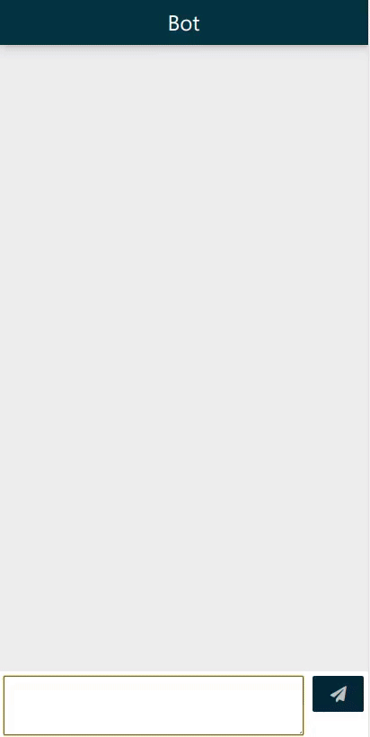

<h2 align="center">SingAlongBot</h2>

<h3 align="center">A simple bot that completes your song</h3>

------------------------------------------

- Remember those moments when you start humming/singing a song and other people join in? Or when you sing one line of a song and your friend sings the next?
- This is a simple chatbot that completes the lyrics to any song.
- The sing functionality of this bot was integrated into the `KJSCE Codecell` workshop registration bot. It can be found [here](https://github.com/kjsce-codecell/Chatbot-Codecell)
- This chatbot was made in less than 24hrs.

------------------------------------------
### Features

- `Sing` A keyword initialises the sing along feature of the bot to continue lyrics to the song suggested by the user.
- `Animal pics` - Fetches animal pics from various subreddits to brighten up your day

- Can alleviate boredom with some casual conversation or by fetching jokes from [r/programmerhumor](https://reddit.com/r/programmerhumor)

------------------------------------------
### How it Works
When the sing functionality is triggered, it searches for the user input on the internet using **Google Custom Search**.

On searching, the bot looks up the highest ranked result of [Genius.com](http://genius.com) and fetches the page. 

On that lyrics page it looks for the line that most closely resembles user input and sends back the next line after that.

------------------------------------------

  

------------------------------------------
### Test the Bot

Web Interface  
[https://demo-chatbot-codecell.herokuapp.com](https://demo-chatbot-codecell.herokuapp.com)

------------------------------------------

### Contributors
[@akshay-99](https://github.com/akshay-99)  
[@hetzz](https://github.com/hetzz)

